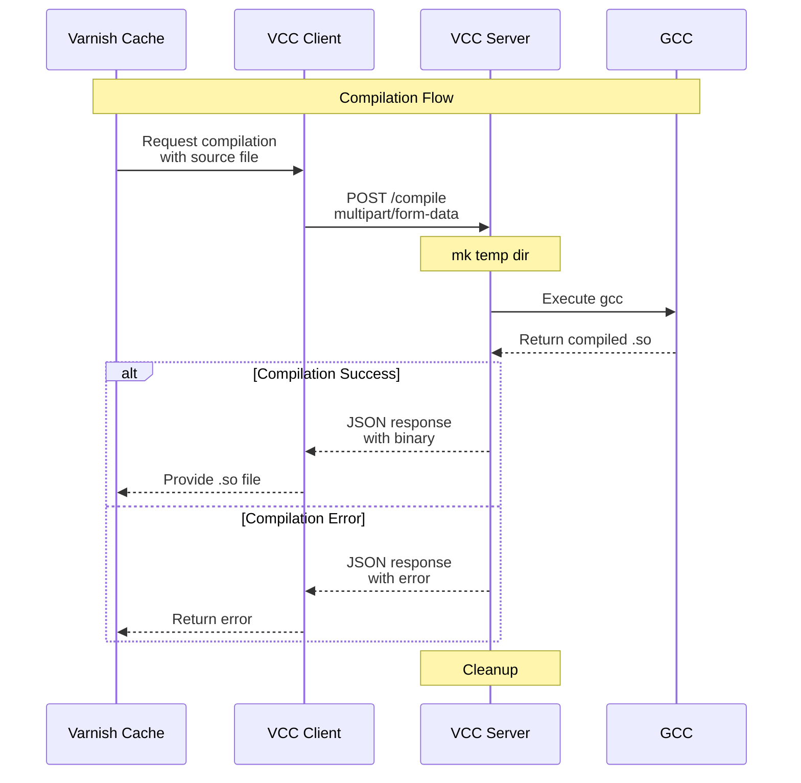

# Varnish Cache Command Compiler

A client-server solution for compiling Varnish Cache VCL remotely. This
enables to compile VCL into shared objects (.so files) using a HTTP service,
making it suitable for environments where local compilation is not desired
or possible.

## Components

- **vc-gcc-client**: A Go program that sends source files to the compilation service (use as cc_command parameter in Varnish)
- **vc-gcc-server**: A Go-based HTTP service that compiles the source files using GCC

## Compilation Flow



## Configuration

### Environment Variables

vc-gcc-client:
- `VS_GCC_SERVER`: URL of compilation service (default: "http://localhost:8080")

vc-gcc-server:
- `VS_GCC_PORT`: Port to listen on (default: "8080")

## Usage

1. Start the server:
```bash
./vcc-server
```

2. Configure Varnish to use the client:
```vcl
parameter cc_command = "/path/to/vcc-client %s %s";
```

## Container deployment

## Components

 - image: **varnish-plus-vs-gcc** - quay.io/varnish-software/varnish-plus:latest image with embedded vc-gcc-client and disabled gcc
 - image: **vc-gcc-server** - quay.io/varnish-software/varnish-plus:latest image with embedded vc-gcc-server

## Test setup

1. Build the Docker images:
```bash
docker compose build
```

2. Start the services:
```bash
docker compose up
```

3. Test the client:
```bash
./test.sh
```

4. Enter varnish container:
```bash
docker exec -it vs-gcc-varnish-plus-vs-gcc-1 bash
varnishadm vcl.load test /etc/varnish/default.vcl
varnishadm vcl.use test
```
